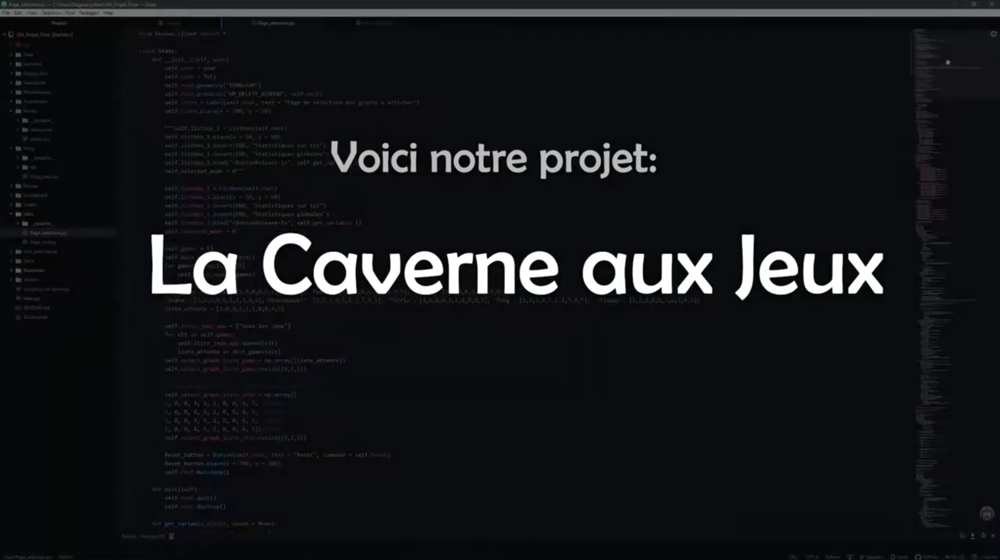

# Caverne aux Jeux

### 👉 [🇫🇷 Version française](README_fr.md)

Video

Video

docker run --rm -v "$(pwd)":/data -u $(id -u):$(id -g) pandoc/latex --output=docs/user_guide.pdf docs/user_guide.md

## CI/CD

This project uses GitHub Actions for continuous integration:

- On every push and pull request, the workflow:
  - Installs dependencies and runs a test command to ensure the project starts without errors.
  - Builds and tests the Docker container.
  - Builds standalone executables for Linux and Windows using PyInstaller.

- On release, the workflow:
  - Uploads the built executables as release artifacts for both Linux and Windows.

