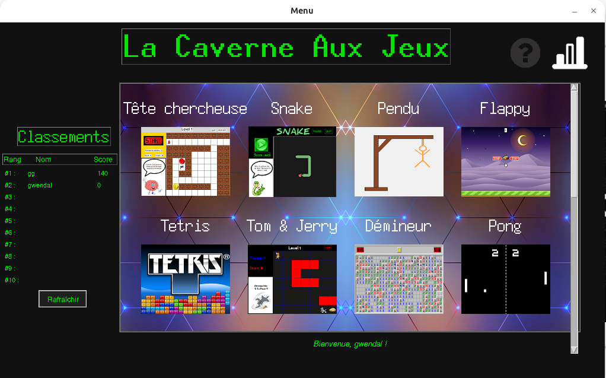
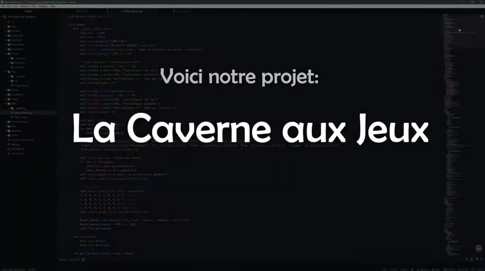

# Caverne aux Jeux

[](https://creativecommons.org/licenses/by-nc/4.0/) [](https://github.com/gwendalauphan/Caverne_aux_jeux/stargazers) [](https://github.com/gwendalAuphan/game-platform/releases) [](https://github.com/gwendalauphan/Caverne_aux_jeux/commits/main)


### 👉 [🇬🇧 English version](README.md)

## Auteurs

* [Gwendal Auphan](https://github.com/gwendalauphan)
* [Dorian Gaspar](https://github.com/dogasp)

Caverne aux Jeux est une plateforme de mini‑jeux que j'ai réalisée avec mon ami [Dorian Gaspar](https://github.com/dogasp). Elle dispose d'un mode serveur qui permet aux joueurs d'enregistrer leurs scores et de consulter les classements. À la base, il s'agissait du projet de fin d'année pour le bac, mais, poussés par la passion du code, nous avons porté le projet plus loin. Laissé à l'abandon pendant plusieurs années, j'ai décidé de le remettre au goût du jour et d'ajouter des fonctionnalités orientées développeur.



## Table des matières

- [Caverne aux Jeux](#caverne-aux-jeux)
    - [👉 🇬🇧 English version](#--english-version)
  - [Auteurs](#auteurs)
  - [Table des matières](#table-des-matières)
  - [Description](#description)
    - [Mini‑jeux présents](#minijeux-présents)
    - [Futurs jeux potentiels](#futurs-jeux-potentiels)
  - [Vidéo](#vidéo)
- [🚀 Quick Start – Caverne aux Jeux](#-quick-start--caverne-aux-jeux)
  - [1. Télécharger le jeu](#1-télécharger-le-jeu)
  - [2. Lancer le jeu](#2-lancer-le-jeu)
    - [Mode simple (client seul)](#mode-simple-client-seul)
    - [Mode client-serveur (multijoueur et sauvegarde)](#mode-client-serveur-multijoueur-et-sauvegarde)
  - [3. Méthode avancée (développeurs)](#3-méthode-avancée-développeurs)
    - [Cloner le dépôt](#cloner-le-dépôt)
    - [Exécuter avec Python](#exécuter-avec-python)
    - [Build avec Makefile](#build-avec-makefile)
    - [Docker Compose](#docker-compose)
  - [4. Dépendances](#4-dépendances)
- [👩‍💻 Guide Développeur](#-guide-développeur)
  - [Cloner et contribuer](#cloner-et-contribuer)
  - [Prérequis](#prérequis)
  - [CI/CD](#cicd)
  - [Documentation](#documentation)
- [Licence](#licence)


## Description

Le principe de l’application est de réunir plusieurs mini‑jeux, incluant un aspect compétitif. Chaque mini‑jeu a un mécanisme de scoring propre, et les scores sont enregistrés sur un serveur. L'application permet aux utilisateurs de jouer à ces jeux, de consulter leurs scores, et de voir les classements globaux.

La partie serveur est assez intéressante car elle n'est pas conventionnelle. À vrai dire, je dirais qu'elle n'est pas vraiment au niveau de l'application : il faut se remettre dans le contexte, nous n'étions que de jeunes débutants à l'époque. Ainsi, le serveur communique directement en sockets avec l'application et enregistre les données en dur dans des fichiers.

Le jeu a été créé en français, et il n'existe pas de version anglaise.

### Mini‑jeux présents

* Fantome
* Flappy Bird
* Minesweeper
* Pendu
* Pong
* Snake
* Tete Chercheuse
* Tetris

### Futurs jeux potentiels

* puissance 4
* pac man
* qui-est-ce ?
* space invaders
* morpion

---

## Vidéo

[](https://github.com/user-attachments/assets/0a5b37ea-5928-44da-a21e-fda9c0c20f7d)

---

# 🚀 Quick Start – Caverne aux Jeux

## 1. Télécharger le jeu

La façon la plus simple d’installer le jeu est de télécharger une **release** :
👉 [Caverne aux Jeux Releases](https://github.com/gwendalauphan/Caverne_aux_jeux/releases)

Choisissez la version correspondant à votre système d’exploitation :

* **Windows**
* **Linux**
* **macOS** (utilisez le binaire Linux, le lancement est identique à Linux)

Une fois téléchargé, vous aurez deux exécutables :

* `client.exe` → le jeu
* `server.exe` → le serveur (optionnel)

---

## 2. Lancer le jeu

> **Note :** Sous **Linux** et **macOS**, la procédure de lancement est identique. Les commandes et dépendances sont les mêmes.

### Mode simple (client seul)

```bash
./client # (sous Linux et macOS)
./client.exe # (sous Windows)
```

* Entrez un **username**.
* Choisissez un jeu et commencez à jouer.

### Mode client-serveur (multijoueur et sauvegarde)

1. Lancez le serveur :

   ```bash
   ./server # (sous Linux et macOS)
   ./server.exe # (sous Windows)
   ```
2. Lancez ensuite le client :

   ```bash
   ./client # (sous Linux et macOS)
   ./client.exe # (sous Windows)
   ```

* Les données de jeu sont alors stockées côté serveur.

---

## 3. Méthode avancée (développeurs)

> **Note :** Sous **Linux** et **macOS**, la procédure d'installation et d'exécution est la même.

### Cloner le dépôt

```bash
git clone https://github.com/gwendalauphan/Caverne_aux_jeux.git
cd Caverne_aux_jeux
```

### Exécuter avec Python

```bash
python3 -m venv .venv
source .venv/bin/activate
pip install -r requirements.txt
python -m app.Reseau.server   # serveur
python -m app.main            # client
```

### Build avec Makefile

```bash
make build-linux
make run-linux
```

### Docker Compose

```bash
xhost +local:docker
cd docker
docker compose up -d
xhost -local:docker
```

---

## 4. Dépendances

> **Note :** Sous **macOS**, installez les dépendances via Homebrew (`brew install python3-tk make`).

```bash
sudo apt update
sudo apt install python3 python3-tk make
```
Pour le lancement avec Docker, assurez-vous que Docker et Docker Compose sont installés et configurés correctement.


👉 Pour plus de détails, consultez la [documentation utilisateur](./docs/user_guide_fr.md).

---

# 👩‍💻 Guide Développeur

## Cloner et contribuer

```bash
git clone https://github.com/gwendalauphan/Caverne_aux_jeux.git
cd Caverne_aux_jeux
```

Vous pouvez contribuer en :

* **Forkant** le dépôt et en ouvrant une **Pull Request**.
* **Signalant un bug ou une idée** dans les **issues**.

---

## Prérequis

Le développement nécessite :

* **Python 3** et **tkinter**
* **make**, **docker**, **docker compose**
* **Poetry** (gestion des dépendances)

Installation des dépendances :

```bash
poetry install
```

Commandes utiles avant de committer :

```bash
poetry run black .     # formatage
poetry run flake8 .    # linting
poetry run pylint .    # analyse
poetry run mypy .      # typage
poetry run pytest tests/  # tests unitaires
```

Exporter les dépendances :

```bash
poetry export -f requirements.txt --output requirements.txt --without-hashes
poetry export -f requirements.txt --output build_requirements.txt --only build --without-hashes
poetry export -f requirements.txt --output test_requirements.txt --only test --without-hashes
```

---

## CI/CD

Le projet utilise **GitHub Actions** pour assurer la qualité du code :

* **Sur chaque push/pull request** : installation des dépendances, linting, tests, build Docker, build exécutables Linux/Windows.
* **Sur chaque release** : publication automatique des exécutables Linux et Windows en tant qu’artifacts.

---

## Documentation

La documentation complète est disponible dans le dossier `docs/` :

* [Guide Utilisateur](docs/user_guide_fr.md)
* [Guide Développeur](docs/developer_guide_fr.md)
* [Rapport du projet](docs/Rapport_Caverne_aux_jeux.pdf)
* [Présentation du projet](docs/Prez_Caverne_aux_jeux.pdf)
* [Changelog](docs/Changelog.md)

Pour **convertir** la documentation Markdown en PDF :

```bash
docker run --rm -v "$(pwd)":/data \
-w /data/docs   -u $(id -u):$(id -g) \
fpod/pandoc-weasyprint   --from=markdown   --to=html5 \
--pdf-engine=weasyprint   --metadata author="Gwendal Auphan" \
--metadata lang=fr-FR   -c style.css   -o user_guide.pdf user_guide.md
```

---

👉 Guide complet : [Guide du Développeur](./docs/developer_guide_fr.md)

# Licence
Ce projet est sous licence Creative Commons Attribution - Pas d’Utilisation Commerciale 4.0 International (CC BY-NC 4.0).

© 2025 Auphan Gwendal & Dorian Gaspar.
Vous devez mentionner les auteurs originaux lors de l’utilisation ou du partage de ce projet.
L’utilisation commerciale est interdite sauf autorisation expresse des auteurs.
