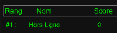
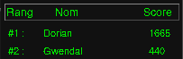
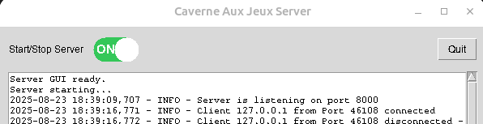

# User Guide – Caverne aux Jeux
**Authors**:
- *Gwendal Auphan*
- *Dorian Gaspar*

# Table of Contents
- [User Guide – Caverne aux Jeux](#user-guide--caverne-aux-jeux)
- [Table of Contents](#table-of-contents)
- [Introduction](#introduction)
- [Download and Installation](#download-and-installation)
  - [Simple method: Download releases](#simple-method-download-releases)
    - [Note for Windows](#note-for-windows)
  - [Advanced method: Clone the repository](#advanced-method-clone-the-repository)
    - [a) Build with Makefile](#a-build-with-makefile)
    - [b) Run with Docker Compose](#b-run-with-docker-compose)
    - [c) Run with Python](#c-run-with-python)
- [Running the Game](#running-the-game)
  - [Client mode](#client-mode)
  - [Client-server mode](#client-server-mode)
- [Game Modes](#game-modes)
- [Troubleshooting](#troubleshooting)
  - [Common issues on Windows](#common-issues-on-windows)
  - [Common errors](#common-errors)
- [Additional Resources](#additional-resources)
  - [Installing dependencies](#installing-dependencies)

---

# Introduction

Welcome to the user documentation for **Caverne aux Jeux**.
This guide explains how to **download**, **install**, and **run the game**, as well as the different options available for playing in client or server mode.

---

# Download and Installation

## Simple method: Download releases

1. Go to the official **releases** page: [Caverne aux Jeux Releases](https://github.com/gwendalauphan/Caverne_aux_jeux/releases)
2. Download the package for your operating system and desired version:
   * Windows
   * Linux
3. Once downloaded, you will have two executables:

   * `client.exe` (the game)
   * `server.exe` (the server)

### Note for Windows

* **Windows Security** may block execution of the files.
* Check your security settings and allow execution of the executables.
* If Windows warns you about an unknown source, click **“Continue anyway”** to launch the application.

---

## Advanced method: Clone the repository

You can also clone the [Caverne aux Jeux](https://github.com/gwendalauphan/Caverne_aux_jeux) repository and run the game in different ways:

```bash
git clone https://github.com/gwendalauphan/Caverne_aux_jeux.git
cd Caverne_aux_jeux
```

### a) Build with Makefile

* Requirements:

  * `make`, `python3`, `python3-tk` installed.
  * If not, follow this guide: [Installing dependencies](#installing-dependencies).
* Build the project with the `make` command.
* Run the game from the generated binaries.

```bash
make help
# -->
Available targets:
  build-linux        Build Linux executables with PyInstaller
  build-linux-debug  Build Linux executables with PyInstaller (debug mode)
  build-windows      Build Windows executables with PyInstaller (run on Windows)
  build-windows-debug  Build Windows executables with PyInstaller (debug mode)
  run-linux          Run Linux server+client
  run-windows        Run Windows server+client
  clean              Remove build artifacts

# Example for Linux
make build-linux
make run-linux
```

### b) Run with Docker Compose

* Running with Docker requires enabling X11 access.
* Use the following commands to build and start the server and client:

```bash
xhost +local:docker    # Allow X11 display access
cd docker
docker compose up -d
xhost -local:docker    # Revoke X11 display access
```

### c) Run with Python

* Requirements:

  * `python3`, `python3-tk` installed.
  * If not, follow this guide: [Installing dependencies](#installing-dependencies).
* Run the game directly from the source code with Python.
* Make sure all dependencies are installed beforehand.

```bash
python3 -m .venv
source .venv/bin/activate
pip install -r requirements.txt
python -m app.Reseau.server # Start the server
python -m app.main # Start the game
```

---

# Running the Game

## Client mode

* Run the file `client.exe`.
* The game will ask you for a **login (username only)**.
* Once connected, you can access the available mini-games.
* Each game has its own scoring mechanism and contributes to the global leaderboard.
* Game rules are displayed before each game starts.

## Client-server mode

* Start the server with `server.exe`.
* Then launch the client with `client.exe`.
* The server stores game data for multiple users.
* This will eventually allow other players to connect to the server using its IP address and port. **(Feature coming soon)**

---

# Game Modes

* **Offline mode (without server)**:
  You can play directly without starting the server.
  

* **Online mode (with server)**:
  Game data is centralized on the server, enabling multiple users and progress tracking.
  

You can enable or disable the server in real time through a graphical interface.


---

# Troubleshooting

## Common issues on Windows

* Windows blocks execution → check security settings.
* Warning “Unknown publisher” → click **“Continue anyway”**.

## Common errors

* Missing tkinter and graphical libraries (when running with Python).
* Docker not configured properly.
* Make not installed.
* Server port already in use or not open.

---

# Additional Resources

* Official repository: [Caverne aux Jeux](https://github.com/gwendalauphan/Caverne_aux_jeux)
* Detailed technical documentation and presentation:

  * [Report](https://github.com/gwendalauphan/Caverne_aux_jeux/blob/main/docs/Rapport_Caverne_aux_jeux.pdf)
  * [Presentation](https://github.com/gwendalauphan/Caverne_aux_jeux/blob/main/docs/Prez_Caverne_aux_jeux.pdf)
* Development and contribution guide:

  * [Developer Guide](https://github.com/gwendalauphan/Caverne_aux_jeux/blob/main/docs/developer_guide.md)
  * [Changelog](https://github.com/gwendalauphan/Caverne_aux_jeux/blob/main/docs/Changelog.md)

---

## Installing dependencies

To run the project locally on Linux, system dependencies must be installed. Run:

```bash
sudo apt update
sudo apt install python3 python3-tk
```

If `python3-tk` is not found, your APT sources may not be configured correctly.

* Check that `/etc/apt/sources.list.d/ubuntu.sources` includes:

  * Suites matching your Ubuntu version (jammy, noble, …).
  * Components: `main restricted universe multiverse`.

To verify that `python3-tk` is available:

```bash
apt-cache policy python3-tk
```
