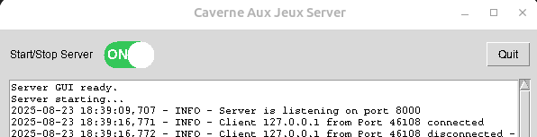

# Documentation Utilisateur – Caverne aux Jeux
**Auteurs** :
- *Gwendal Auphan*
- *Dorian Gaspar*

# Table des matières
- [Documentation Utilisateur – Caverne aux Jeux](#documentation-utilisateur--caverne-aux-jeux)
- [Table des matières](#table-des-matières)
  - [1. Introduction](#1-introduction)
  - [2. Téléchargement et installation](#2-téléchargement-et-installation)
    - [2.1. Méthode simple : Télécharger les releases](#21-méthode-simple--télécharger-les-releases)
      - [Note pour Windows](#note-pour-windows)
    - [2.2. Méthode avancée : Cloner le dépôt](#22-méthode-avancée--cloner-le-dépôt)
      - [a) Build avec Makefile](#a-build-avec-makefile)
      - [b) Lancement avec Docker Compose](#b-lancement-avec-docker-compose)
      - [c) Lancement avec Python](#c-lancement-avec-python)
  - [3. Lancer le jeu](#3-lancer-le-jeu)
    - [3.1. Mode client](#31-mode-client)
    - [3.2. Mode client-serveur](#32-mode-client-serveur)
  - [4. Modes de jeu](#4-modes-de-jeu)
  - [5. Dépannage](#5-dépannage)
    - [5.1. Problèmes fréquents sous Windows](#51-problèmes-fréquents-sous-windows)
    - [5.2. Erreurs courantes](#52-erreurs-courantes)
  - [6. Ressources supplémentaires](#6-ressources-supplémentaires)
    - [6.1 Installation des dépendances](#61-installation-des-dépendances)

## 1. Introduction

Bienvenue dans la documentation utilisateur de Caverne aux Jeux.
Ce guide vous explique comment **télécharger**, **installer** et **lancer le jeu**, ainsi que les différentes options disponibles pour jouer en mode client ou serveur.

---

## 2. Téléchargement et installation

### 2.1. Méthode simple : Télécharger les releases

1. Rendez-vous sur la page des **releases** du Jeu: [Caverne aux Jeux Releases](https://github.com/gwendalauphan/Caverne_aux_jeux/releases)
2. Téléchargez le paquet correspondant à votre système d’exploitation ainsi que la version souhaitée:
   * Windows
   * Linux
3. Une fois téléchargé, vous aurez à disposition deux exécutables :

   * `client.exe` (le jeu)
   * `server.exe` (le serveur)

#### Note pour Windows

* Il est possible que **Windows Security** bloque l’exécution des fichiers.
* Vérifiez vos paramètres de sécurité et autorisez l’exécution des exécutables.
* Lors de l’avertissement Windows indiquant une source inconnue, cliquez sur **« Je continue »** pour lancer l’application.

---

### 2.2. Méthode avancée : Cloner le dépôt

Vous pouvez également cloner directement le dépôt [Caverne aux Jeux](https://github.com/gwendalauphan/Caverne_aux_jeux) et lancer le jeu de différentes manières :
```bash
git clone https://github.com/gwendalauphan/Caverne_aux_jeux.git
cd Caverne_aux_jeux
```

#### a) Build avec Makefile

* Prérequis :
  * Avoir `make`, `python3`,`python3-tk` installés.
  * Se ce n'est pas le cas, veuillez suivre ce guide : [Installation des dépendances](#61-installation-des-dépendances)
* Compiler le projet avec la commande `make`.
* Lancer le jeu à partir des binaires générés.
```bash
make help
# -->
Available targets:
  build-linux        Build Linux executables with PyInstaller
  build-linux-debug  Build Linux executables with PyInstaller (debug mode)
  build-windows      Build Windows executables with PyInstaller (run on Windows)
  build-windows-debug  Build Windows executables with PyInstaller (debug mode)
  run-linux          Run Linux server+client
  run-windows        Run Windows server+client
  clean              Remove build artifacts

# Example for Linux
make build-linux
make run-linux
```

#### b) Lancement avec Docker Compose

* L'utilisation avec Docker nécessite l'autorisation de X11.
* Lancer la commande suivante pour builder et démarrer le serveur et le jeu:
```bash
xhost +local:docker    # Autoriser l'accès à l'affichage X11
cd docker
docker compose up -d
xhost -local:docker    # Retirer l'accès à l'affichage X11
```

#### c) Lancement avec Python

* Prérequis :
  * Avoir `python3`,`python3-tk` installés.
  * Se ce n'est pas le cas, veuillez suivre ce guide : [Installation des dépendances](#61-installation-des-dépendances)
* Lancer le jeu directement depuis le code source avec Python.
* Vérifier que toutes les dépendances sont installées au préalable.

```bash
python3 -m .venv
source .venv/bin/activate
pip install -r requirements.txt
python -m app.Reseau.server # Lancer le serveur
python -m app.main # Lancer le jeu
```

---

## 3. Lancer le jeu

### 3.1. Mode client

* Exécutez le fichier `client.exe`.
* Le jeu vous demandera un **login (username uniquement)**.
* Une fois connecté, vous pouvez accéder aux différents jeux.
* Chaque jeu a son propre mécanisme de score et rapporte des points au classement général.
* Les règles de chaque jeu sont affichées à l'écran avant de commencer.

### 3.2. Mode client-serveur

* Lancez d’abord le serveur avec `server.exe`.
* Ensuite, lancez le client avec `client.exe`.
* Le serveur permet de stocker les données de jeu pour plusieurs utilisateurs.
* Il permet ainsi à d'autres utilisateurs de se connecter au serveur en indiquant l'adresse IP et le port du serveur. **(Feature à venir)**

---

## 4. Modes de jeu

* **Mode en ligne sans serveur** :
  Vous pouvez jouer directement sans avoir lancé le serveur.
  

* **Mode en ligne avec serveur** :
  Les données de jeu sont centralisées sur le serveur, permettant de gérer plusieurs utilisateurs et de conserver leur progression.
  

Vous pouvez décider d'activer ou désactiver le serveur en temps réel via une interface graphique.
  

---

## 5. Dépannage

### 5.1. Problèmes fréquents sous Windows

* Windows bloque l’exécution : vérifier les paramètres de sécurité.
* Avertissement « éditeur inconnu » : choisir **« Je continue »**.

### 5.2. Erreurs courantes

* Dépendances tkinter et librairies graphiques manquantes (en mode Python).
* Docker non configuré correctement.
* Make non installé.
* Port du serveur déjà utilisé ou non ouvert.

---

## 6. Ressources supplémentaires

* Lien vers le dépôt officiel : [Caverne aux Jeux](https://github.com/gwendalauphan/Caverne_aux_jeux)
* Documentation et présentation technique détaillée:
  * [Rapport](https://github.com/gwendalauphan/Caverne_aux_jeux/blob/main/docs/Rapport_Caverne_aux_jeux.pdf)
  * [Présentation](https://github.com/gwendalauphan/Caverne_aux_jeux/blob/main/docs/Prez_Caverne_aux_jeux.pdf)
* Guide de développement et contribution :
  * [Guide du développeur](https://github.com/gwendalauphan/Caverne_aux_jeux/blob/main/docs/developer_guide_fr.md)
  * [Changelog](https://github.com/gwendalauphan/Caverne_aux_jeux/blob/main/docs/Changelog.md)


### 6.1 Installation des dépendances
Afin d'executer le projet localement sous linux, il est nécessaire d'installer des dépendances système. Vous pouvez le faire en exécutant la commande suivante :

```bash
sudo apt update
sudo apt install python3 python3-tk
```

Si python3-tk n’est pas trouvé, cela signifie que les sources APT ne sont pas correctement configurées.

* Vérifier que le fichier /etc/apt/sources.list.d/ubuntu.sources contient bien :
  * Les Suites correspondant à votre version Ubuntu (jammy, noble, …).
  * Les Components : main restricted universe multiverse.

Pour s'assurer que python3-tk est retrouvable, vous pouvez exécuter la commande suivante :

```bash
apt-cache policy python3-tk
```
